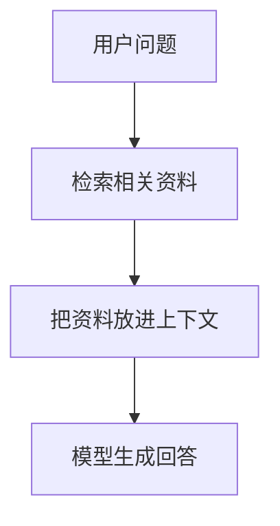
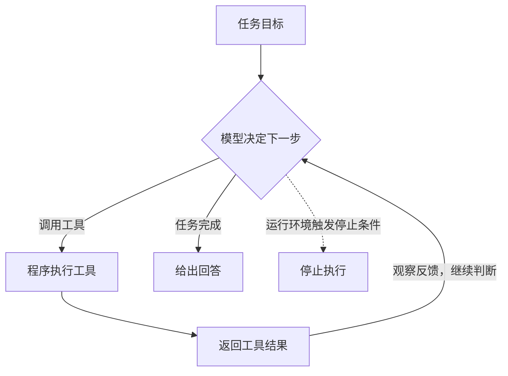
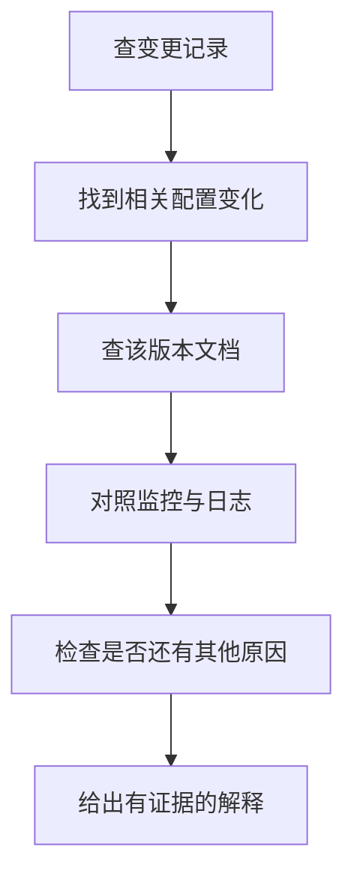

已经不知道多少次看到网友们争论“RAG 已死”这类话题了，每次看到都会有些无力地笑一下。关键是在现实生活中，我也遇到过多次客户的“逆天言论”。于是我决定写一篇文章，回头发到自媒体，也顺便帮自己理清一下边界，反驳时能把依据讲明白。至于他们听不听得懂，那是另一回事了。

先把两个词分开：

RAG 关注如何用检索到的外部资料辅助生成。

LLM Agent 关注如何围绕目标选择行动、观察结果并继续推进。

两者可以组合，不能只凭名字判断谁更先进。

## RAG 到底是什么

> 说实话，我甚至怀疑，有些争论的人连全称都拼不出来。

RAG 是 **Retrieval-Augmented Generation，检索增强生成**。按现在常见的工程用法，就是根据当前问题或任务检索外部资料，把相关内容放进模型上下文，再让模型据此生成回答。[LangChain 的 Retrieval 文档](https://docs.langchain.com/oss/python/deepagents/retrieval)也采用这条解释路径。

比如询问一个项目如何部署，系统先找出对应版本的部署文档，再让模型结合文档回答。这是一个说明机制的例子，不是一次实测。

这里增强的是模型回答时能使用的信息。通常，给现成模型接入知识库，并不需要每次更新文档都重新训练模型；资料进入上下文，也不意味着它被永久学进了模型参数。

作为历史锚点，Lewis 等人在 2020 年的 [RAG 论文](https://arxiv.org/abs/2005.11401)中，把生成模型与外部稠密向量索引结合起来，并研究联合微调。所以也别把“RAG 绝对不涉及训练”写成定义。原论文的具体模型与今天泛称的 RAG 应用，范围不完全相同。

举个做知识库问答时很常见的例子。模型也许在训练时见过公开的工时规定，却不知道我们公司的作息安排。这时，就需要把公司的员工守则给到模型。假设守则和配套制度经过分词后一共有 2M token，而当前模型的上下文只有 200K，根本塞不下。

一种常见的做法，就是把文档切片、向量化，再放入向量数据库。收到用户的问题后，通过向量相似度检索召回相关片段，补入上下文，让模型据此回答。这表示“模型这次查到了”。

比如，标准工时制度下的“每日 8 小时、每周 40 小时”，直接依据是[《国务院关于职工工作时间的规定》第三条](https://xzfg.moj.gov.cn/mobile/law/detail?LawID=629)。但在这个例子里，员工守则却写着：员工们需要在下班后留在公司努力提升自我。（大家都在假加班来安慰老板，且没有加班费，也不属于员工互相内卷，纯粹是被奇怪的规则裹挟。）

模型现在知道了公司的说法[狗头]。

## 切片、向量库、关键词，分别在哪一层

把文档切片、生成 Embedding、存进向量库，是常见实现，但不能拿这一套代替 RAG 的完整定义。仅建好一个搜索库，还缺少“利用检索结果生成”的部分。

几个容易混在一起的词，可以按职责来记：

| 概念 | 它负责什么 |
| --- | --- |
| Chunking，切片 | 把长资料拆成便于检索和放入上下文的片段；切坏了可能丢掉前后关系 |
| Embedding，向量表示 | 把内容映射为数值向量，便于按相似度查找；相似不代表事实正确 |
| BM25 | 按词项匹配及统计信息计算相关性，是一种词法检索评分方法 |
| Hybrid Search，混合检索 | 合并不同检索方式的候选，例如词法检索与向量检索 |
| Reranking，重排序 | 对已经召回的候选重新评分排序；单靠重排不能补回没召回的资料 |
| Top-K | 取某一步排名前 K 个结果；它是数量限制，不是真实性保证 |

向量检索能帮助匹配不同表述，词法检索在错误码、标识符等精确匹配上也有用武之地。[Anthropic 的 Contextual Retrieval 文章](https://www.anthropic.com/engineering/contextual-retrieval)给出了两者结合并增加重排的实例。因此，截图里那位热心网友用“RAG 极度依赖关键词命中”来解释 RAG，我觉得连半桶水都算不上。这句话把一种检索方式的限制扩大成了整个方法的定义。

图结构也是一种组织和检索信息的方式。例如 [Microsoft GraphRAG](https://microsoft.github.io/graphrag/)会从文本中抽取实体关系、组织社区并生成摘要，查询时利用这些结构。它并不等于所有图检索，也不会因为用了图就自动成为 Agent。

**用什么方法找资料，与谁决定何时去找，是两个不同的问题。** 固定流程和 Agent 都可以使用关键词、向量或图检索。

至于“直接上 Agent，让它自己去查找资料”，我倒想接着问一句：查回来的资料，最后是不是还要交给模型生成答案？在这个场景里，变化的是谁来决定怎么查。把检索做成工具交给 Agent 调用，不会让 RAG 自动消失。真要按这个逻辑，那我给数据库套一层 API，是不是也算把数据库淘汰了？

## Agent 多出来的是哪些决策

Agent 的叫法并不完全统一。本文讨论的是 LLM Agent：模型在程序提供的工具、权限和停止条件内，根据目标与反馈参与决定下一步行动。

可以借用 [Anthropic 对 Workflow 和 Agent 的区分](https://www.anthropic.com/engineering/building-effective-agents)：前者主要沿预先编排的路径执行，后者让模型动态参与流程和工具选择。实际系统可以混合两种方式。

一次工具调用只是其中一个动作。调用之后，系统还需要把结果交回模型，让它据此继续、换办法或结束。工具由程序执行，模型不会因为生成了一个函数名就直接完成操作。

这种把推理、行动与反馈交替组织起来的思路，可以参考 2022 年的 [ReAct 论文](https://arxiv.org/abs/2210.03629)。代码层面的循环也可以接着看博客里已有的 [Agent Loop 怎么写](https://blog.anluoying.com/posts/agent-loop-怎么写/)。

打个不太严谨的比方，LLM 套上这层框架以后，好像就有了“主观能动性”。具体到实现，落在几件事上：模型能否选择工具、调整查询、依据结果重试，以及判断何时停止。这些能力都需要运行环境提供支持，也都可能判断失误。

把 RAG 和 Agent 当成非得二选一的东西，在我看来，就像把“我会按键盘”和“我会打 CS:GO”放在同一个层面上比较。前者可以类比检索增强这项能力，后者可以类比组织多种能力完成一个任务。

这是局部能力与完整任务的关系。**Agent 可以使用 RAG，并不意味着每个 Agent 都必须包含 RAG**。RAG 本身也可以独立构成一个问答应用。两者也不是必然的包含关系。

## Agentic RAG 改变了什么

一个简单的两步式 RAG，会在生成答案前执行检索。Agentic RAG 则让模型参与决定是否检索、查什么、用哪个来源，以及是否继续查；这也是 [LangChain 文档对 Agentic RAG 的描述](https://docs.langchain.com/oss/python/deepagents/retrieval#agentic-rag)。

比如下面这个假设任务：

> 为什么服务升级后变慢了？

一种可能的调查路径如下：

下一次查什么，可能取决于上一次查到了什么。查资料可以形成检索增强生成，计算指标、运行测试等步骤则提供其他类型的反馈。

但“所有 RAG 都是固定、被动的一次检索”同样不准确。2023 年提出的 [Self-RAG](https://arxiv.org/abs/2310.11511)，已经通过训练让模型按需检索，并评价检索内容和生成结果。这足以说明：**固定 Top-K 流程的局限，不能直接等同于全部 RAG 的局限。** Self-RAG 是一项具体方法，也不能当成 Agentic RAG 的别名。

## 到底什么算 RAG

这个边界取决于采用多宽的定义。本文把“检索外部知识，并用它辅助生成”作为判断依据。

早期跟同事解释时，我甚至说过，Function Call 之后把结果回填给模型，从某个角度看也像 RAG：不都是在补充信息、补充上下文吗？

但这句话还得补一个前提：工具返回的是什么。如果它检索了外部知识，再把结果交给模型生成回答，按本文的口径，这就是“检索 → 补充上下文 → 生成”。如果只是算了个数，或者通知模型文件已经写好了，那就不能只凭“回填结果”把它叫作 RAG。

| 行为                 | 按这个口径如何理解             |
| ------------------ | --------------------- |
| 搜文档、网页，再根据结果回答     | 典型的检索增强生成             |
| 查询数据库或知识 API，再据此回答 | 可以纳入广义 RAG；不要求必须走向量库  |
| 执行计算、运行测试、写文件、发邮件  | 属于计算或行动；仅凭这些动作不能叫 RAG |
| 用户直接把整份文档贴进提示词     | 有外部上下文，但没有体现系统检索这一步   |

这里对数据库和 API 的归类，采用的是 [LangChain 文档的较宽口径](https://docs.langchain.com/oss/python/deepagents/retrieval)：检索工具可以连接既有数据库，也可以获取网页或通过 API 取回知识。天气 API 之类的边界例子，不能只因为接口形式是 API 就一概排除，也不能因此把所有 Tool Use 都叫 RAG。

对我来说，亲手构造过 Context，再看这些概念，就更容易把它们对应到具体步骤上。边界确实有讨论空间，但连讨论的是哪种实现都不说清楚，就把整个概念一棒子打死，我实在没法把这种话当成认真的技术讨论。

## 知识库问答还有没有用

能确认的是，不同任务需要不同程度的流程控制。问题明确、资料范围稳定时，固定检索流程可能已经够用；调查路径不确定、需要多轮查证或继续执行动作时，才有理由增加模型的决策空间。Agent 也会带来额外调用、延迟和错误累积，不能只凭演示更复杂就认定交付效果更好。[Anthropic 的工程建议](https://www.anthropic.com/engineering/building-effective-agents#when-and-when-not-to-use-agents)也是从简单方案开始，再根据实际效果增加复杂度。

另外，检索到资料不代表资料正确，附了引用也不代表引用支持结论。可以分开检查：该找的证据有没有找全，回答有没有忠于证据，任务最终有没有完成。Self-RAG 对检索与生成分别作评价，也说明这不是一个“接上知识库就解决了”的问题。

我觉得，单纯做知识库问答在复杂任务里不够用的地方，是一次前置检索未必能覆盖后续才暴露出来的信息需求。生产环境多变，客户的提问方式也多样，就像测试里那个“反着拿勺子喝汤”的用例：开发者预设的使用方式，未必就是实际发生的方式。这里需要的是能根据反馈继续查、换个方向查的能力，Agent 是实现这种能力的一条路线。在我看来，LLM 理解任务、使用工具的能力提升，也给这条路线提供了更大的发挥空间。

我真正想吐槽的是，互联网上有些人只管发言，却不愿意对自己的发言负责。就像今天刷到卡兹克老师无奈地说，自己分享了一些内容之后，总会有人在评论区留言：“这不就是 XXX 吗，这有什么用呢？”

说这话的人挥挥袖子就走了，留下的话却可能刺痛创作者。好在卡兹克他们已经取得了一定的成绩，自有大儒会来辩经。但我也想起自己刚开始在自媒体上发了几篇分享文章后，收到过类似的评论，确实既无奈，也伤心。

技术讨论当然可以有分歧，也可以有情绪，但至少得把哪里错了、为什么错、在什么场景下不成立说清楚。拿出文档、代码或者可以复现的例子，我写错了就改。可如果只是丢下一句“早就过时了”“这有什么用”，既不解释，也不给依据，那我实在不知道，除了表达优越感，这句话还贡献了什么。

我也会写错，也还在学。下次再有人说 RAG 已死，如果是网友，我先问问他知不知道 RAG 的全称，后面就不再回复了，我已引路完成。如果是现实的客户，那没办法，还是得尽力讲一讲。

毕竟嘛，钱难挣，屎难吃。
