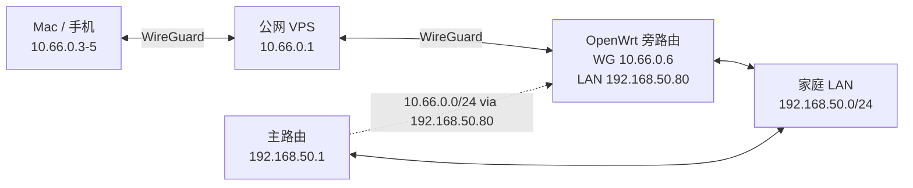

本实验使用一台带公网 IPv4 的 VPS 作为固定 WireGuard 中转节点，使 Mac、手机等终端能够稳定访问 NAT 后面的家庭局域网。家庭侧最终由 OpenWrt 旁路由承载 WireGuard，主路由只增加一条静态路由，家庭服务器本身不再需要运行 WireGuard。

实验最终跑通，但过程中遇到了三个容易混淆的问题：OpenClash 将 WireGuard Endpoint 解析为 Fake-IP、OpenWrt 防火墙主动拒绝 WireGuard 到 LAN 的转发，以及 `wg-quick` 重载配置后没有自动增加新的系统路由。本文按实际排查顺序记录配置、现象、判断依据和结果。

> 本文所有公网地址、域名、密钥、用户名和局域网地址均已替换为文档示例值，不能直接用于真实部署。

## 实验目标与网络结构

目标不是让家庭网络通过 VPS 上网，而是建立一条路径确定的远程访问通道：所有节点主动连接公网 VPS，VPS 永久负责中转，P2P 不作为依赖。

脱敏后的实验地址如下：

| 节点 | 地址或网段 | 作用 |
| --- | --- | --- |
| VPS 公网地址 | `203.0.113.10` | WireGuard 固定入口 |
| WireGuard 域名 | `wg.example.com` | DNS Only A 记录 |
| WireGuard 网段 | `10.66.0.0/24` | 隧道地址空间 |
| VPS | `10.66.0.1` | 中转服务器 |
| 家庭服务器 | `10.66.0.2` | 可选的独立 Peer |
| Mac | `10.66.0.3` | 远程客户端 |
| 手机 | `10.66.0.4`、`10.66.0.5` | 独立客户端 |
| OpenWrt 旁路由 | `10.66.0.6` | 家庭 LAN 的 WireGuard 网关 |
| 家庭 LAN | `192.168.50.0/24` | 需要远程访问的内网 |
| 主路由 | `192.168.50.1` | 家庭默认网关 |
| OpenWrt 旁路由 | `192.168.50.80` | WireGuard 与 OpenClash 所在设备 |
| 家庭服务器 | `192.168.50.227` | 内网访问目标之一 |



VPS 只需要稳定的公网连接、UDP 质量和流量额度。WireGuard 本身对 CPU、内存和磁盘的要求很低；该实验没有使用 ZeroTier Moon、Tailscale DERP 或 Headscale。

## 初始化 VPS

实验服务器使用 Debian 12。初始化时先更新系统并安装 WireGuard、防火墙、二维码、自动安全更新和备份所需工具：

```bash
apt-get update
apt-get -y full-upgrade
apt-get install -y \
  wireguard-tools nftables qrencode unattended-upgrades rsync
```

随后完成以下基础设置：

1. 将管理端 Ed25519 公钥写入 `/root/.ssh/authorized_keys`。
2. 确认公钥能够独立登录后，关闭 SSH 密码认证。
3. 开启 unattended-upgrades。
4. 开启 IPv4 转发。
5. 配置 nftables，只开放 SSH 和 WireGuard。

SSH 加固配置放在 `/etc/ssh/sshd_config.d/99-hardening.conf`：

```text
PubkeyAuthentication yes
PasswordAuthentication no
KbdInteractiveAuthentication no
PermitRootLogin prohibit-password
```

应用前必须先检查语法，并保留当前 SSH 会话：

```bash
sshd -t
systemctl reload ssh
```

IPv4 转发写入 `/etc/sysctl.d/99-wireguard-forward.conf`：

```text
net.ipv4.ip_forward=1
```

```bash
sysctl --system
```

## 融合怪：IP 解锁与大陆网络质量

服务上线后使用融合怪检查 IP 解锁、IP 质量和大陆三网线路。Shell 版 `ecs.sh` 会临时改写 `limits.conf` 和多项 sysctl、调整时钟服务并安装依赖，其 README 也建议生产环境使用 Go 版。因此测试固定使用 Go 版 `v0.1.195`，核对官方 `checksums.txt` 后在临时目录运行。

测试关闭 CPU、内存、磁盘和结果上传。解锁、IP 质量和测速以 `nobody` 身份运行；traceroute 补测只给临时二进制授予 `CAP_NET_RAW`，测试后删除。

### IP 归属与质量

| 项目                   | 结果                                        |
| -------------------- | ----------------------------------------- |
| IPv4                 | AS134835 Starry Network Limited，数据库定位日本东京 |
| IPv6                 | AS134835，`/56`，数据库定位香港                    |

### 平台解锁

IPv4 主要结果：

| 类别 | 可用 | 不可用或异常 |
| --- | --- | --- |
| AI | ChatGPT、Gemini、Grok、Sora 均为日本区 | Claude、Perplexity AI 被拒绝 |
| 国际流媒体 | Netflix、Netflix CDN、Disney+、Amazon Prime Video 均为日本区 | — |
| 日本平台 | Hulu Japan、FOD、D Anime Store | DMM TV 不可用，U-NEXT 被拒绝，TVer 网络错误 |
| 其他 | YouTube 日本区，TikTok 可用 | TikTok 识别区域为 `ALISG` |

IPv6 可用性更不统一：Netflix、Disney+、Gemini、Grok、Sora 和 YouTube 均可用且识别为日本；ChatGPT 返回 `Unknown`，Claude、Perplexity AI 和 U-NEXT 被拒绝。实际使用某个平台时，应分别验证 IPv4 和 IPv6，不能将 IPv4 结果直接外推到双栈客户端。

### 大陆三网回程

线路从 AS134835 进入 BBIX / SoftBank，再分别进入中国电信 163、中国联通 4837 和中国移动 CMI。未检测到 CN2、9929 等优化回程，属于普通公网线路。

| 目标 | traceroute | 5 包 Ping 平均值 | 丢包 |
| --- | --- | ---: | ---: |
| 北京电信 | 30 跳未收到目标回应 | 无回应 | 100% |
| 北京联通 | 30 跳未收到目标回应 | 无回应 | 100% |
| 北京移动 | 14 跳到达 | 59.21 ms | 0% |
| 上海电信 | 12 跳到达 | 74.07 ms | 0% |
| 上海联通 | 13 跳到达 | 114.83 ms | 20% |
| 上海移动 | 15 跳到达 | 62.85 ms | 0% |
| 广州电信 | 30 跳未收到目标回应 | 无回应 | 100% |
| 广州联通 | 13 跳到达 | 130.04 ms | 80% |
| 广州移动 | 14 跳到达 | 65.69 ms | 0% |
| 成都电信 | 12 跳到达 | 103.94 ms | 0% |
| 成都联通 | 13 跳到达 | 118.43 ms | 0% |
| 成都移动 | 16 跳到达 | 65.17 ms | 0% |

Ping 只有 5 个样本，且部分运营商测试端点会过滤 ICMP。因此“无回应”不等于业务流量不可达，80% 丢包也只代表当时收到 1 个回应，不适合外推为长期质量。

### 大陆节点双向测速

| 节点 | VPS → 节点 | 节点 → VPS | 延迟 |
| --- | ---: | ---: | ---: |
| 联通唐山 | 55.18 Mbps | 96.75 Mbps | 133.36 ms |
| 电信上海 | 42.52 Mbps | 2.19 Mbps | 138.98 ms |
| 移动上海 | 62.94 Mbps | 458.56 Mbps | 109.27 ms |

三个节点只是单次快照，不能代表运营商整体质量。但是本次结果清楚显示了方向和运营商差异：移动节点最好，联通延迟更高，电信上海到 VPS 的反向吞吐在该时段明显受限。对 WireGuard 中转场景而言，最终仍应以真实家庭宽带和移动客户端的长时间双向测试为准。

测试前后对 WireGuard 服务、Peer 数量、nftables 规则、sysctl 配置和 `limits.conf` 进行了对照，状态与文件哈希均保持不变。

## 配置 DNS 与 WireGuard 服务端

域名管理端创建一条 A 记录：

```text
wg.example.com → 203.0.113.10
```

该记录必须保持 DNS Only。Cloudflare 普通代理不转发 WireGuard 使用的 UDP 端口，不能开启小黄云代理。

服务端 `/etc/wireguard/wg0.conf` 的关键结构如下，私钥和预共享密钥使用占位符表示：

```ini
[Interface]
Address = 10.66.0.1/24
ListenPort = 51820
PrivateKey = <SERVER_PRIVATE_KEY>
SaveConfig = false

[Peer]
# home-server
PublicKey = <HOME_SERVER_PUBLIC_KEY>
PresharedKey = <HOME_SERVER_PSK>
AllowedIPs = 10.66.0.2/32

[Peer]
# macbook
PublicKey = <MAC_PUBLIC_KEY>
PresharedKey = <MAC_PSK>
AllowedIPs = 10.66.0.3/32

[Peer]
# home-openwrt
PublicKey = <OPENWRT_PUBLIC_KEY>
PresharedKey = <OPENWRT_PSK>
AllowedIPs = 10.66.0.6/32, 192.168.50.0/24
```

同一个网段不能同时归属于两个 Peer。家庭 LAN 最初被分配给家庭服务器，迁移到 OpenWrt 后，家庭服务器只保留自己的 `/32` 地址，`192.168.50.0/24` 只属于 OpenWrt Peer。

服务端启用并检查 WireGuard：

```bash
systemctl enable --now wg-quick@wg0
wg show
ss -lunp | grep 51820
```

## nftables 转发与 NAT

服务端入站默认拒绝，只接受回包、ICMP、SSH 和 WireGuard。转发允许 WireGuard Peer 之间通信，并允许将来按需使用 VPS 作为互联网出口。

```nft
#!/usr/sbin/nft -f
flush ruleset

table inet filter {
  chain input {
    type filter hook input priority filter; policy drop;
    ct state invalid drop
    ct state established,related accept
    iifname "lo" accept
    ip protocol icmp accept
    ip6 nexthdr ipv6-icmp accept
    tcp dport 22 accept
    udp dport 51820 accept
  }

  chain forward {
    type filter hook forward priority filter; policy drop;
    ct state established,related accept
    iifname "wg0" oifname "wg0" accept
    iifname "wg0" oifname != "wg0" accept
  }

  chain output {
    type filter hook output priority filter; policy accept;
  }
}

table ip nat {
  chain postrouting {
    type nat hook postrouting priority srcnat; policy accept;
    oifname != "wg0" ip saddr 10.66.0.0/24 masquerade
  }
}
```

这里没有绑定 `ens3` 等具体公网网卡名，迁移到另一台 VPS 时更容易恢复。应用前先检查语法：

```bash
nft -c -f /etc/nftables.conf
systemctl enable --now nftables
```

## 客户端配置与 Peer 管理

Mac 等普通终端需要同时路由 WireGuard 网段和家庭 LAN：

```ini
[Interface]
PrivateKey = <CLIENT_PRIVATE_KEY>
Address = 10.66.0.3/24
MTU = 1380

[Peer]
PublicKey = <SERVER_PUBLIC_KEY>
PresharedKey = <CLIENT_PSK>
Endpoint = wg.example.com:51820
AllowedIPs = 10.66.0.0/24, 192.168.50.0/24
PersistentKeepalive = 25
```

每台设备必须使用独立的私钥、预共享密钥和隧道地址。一份二维码不是一次性凭证，但只能交给一台设备使用；两台设备共用一个 Peer 会互相覆盖 Endpoint。

为了减少手工修改服务端配置，实验中部署了一个简单的 `wg-man` 管理命令：

```bash
wg-man add iphone
wg-man status
wg-man ls
```

三个子命令分别用于：

- `add`：分配下一个空闲地址，生成独立密钥、客户端配置和 PNG 二维码，重载失败时回滚；
- `status`：显示 WireGuard、nftables、SSH、DNS、监听端口和在线节点摘要；
- `ls`：列出节点名称、地址、最近握手、收发流量和 Endpoint。

### 复用 `wg-man`

该脚本不包含服务端或客户端私钥，可以复用。公开版将环境参数放在独立的 `wg-man.conf`，脚本中只保留文档示例地址。安装时先下载和检查，不直接将网络内容通过管道交给 root shell：

```bash
curl -fsSL https://blog.anluoying.com/downloads/wg-man/wg-man -o /tmp/wg-man
less /tmp/wg-man
bash -n /tmp/wg-man
sudo install -o root -g root -m 700 /tmp/wg-man /usr/local/sbin/wg-man
```

它面向 Debian / Ubuntu + systemd，依赖 `wireguard-tools`、`qrencode`、`util-linux`、`coreutils` 和 `iproute2`：

```bash
sudo apt-get install -y wireguard-tools qrencode util-linux coreutils iproute2
```

再创建 root 专用的配置文件：

```bash
sudo install -o root -g root -m 600 /dev/null /etc/wireguard/wg-man.conf
sudoedit /etc/wireguard/wg-man.conf
```

脱敏配置示例：

```ini
INTERFACE=wg0
ENDPOINT=wg.example.com:51820
VPN_PREFIX=10.66.0
VPN_CIDR=10.66.0.0/24
HOME_LAN=192.168.50.0/24
CLIENT_PREFIX=24
MTU=1380
ONLINE_SECONDS=180
```

启用前需要已存在 `/etc/wireguard/wg0.conf`，且 `wg-quick@wg0` 正在运行。公开版为了让地址分配逻辑保持简单，只支持 IPv4 `/24` WireGuard 网段和“域名或 IPv4 + 端口”形式的 Endpoint。

配置完成后可以直接创建独立 Peer：

```bash
sudo wg-man add iphone-16
sudo wg-man status
sudo wg-man ls
```

`add` 只会在已有 `/24` 网段中增加 Peer 的 `/32` AllowedIPs，因此使用 `systemctl reload` 即可。如果修改的是家庭 LAN 路由等系统路由，仍需要按后文所述重启 `wg-quick` 或单独修改路由表。

该版本没有 `remove` 子命令。撤销节点时需手工删除服务端对应 Peer，再删除该节点的 `.conf`、`.png` 和 `.tsv`。脚本之前已经存在的 Peer 因为没有 `.tsv` metadata，在 `wg-man ls` 中会显示为 `unknown`。

生成物保存在：

```text
/etc/wireguard/clients/
/etc/wireguard/peers.d/
```

`online` 在本实验中表示最近 180 秒内发生过握手，`stale` 表示曾握手但已经超时，`never` 表示从未握手。客户端配置包含私钥，目录必须保持 `0700`，配置文件保持 `0600`。

## 将家庭 LAN 路由职责交给 OpenWrt

OpenWrt 是单臂旁路由，LAN 地址为 `192.168.50.80`，默认网关指向主路由 `192.168.50.1`。其 WireGuard 配置与普通终端不同：它只把 Overlay 网段送进隧道，不能把本地 LAN 再路由回 WireGuard。

```ini
[Interface]
PrivateKey = <OPENWRT_PRIVATE_KEY>
Address = 10.66.0.6/24
MTU = 1380

[Peer]
PublicKey = <SERVER_PUBLIC_KEY>
PresharedKey = <OPENWRT_PSK>
Endpoint = 203.0.113.10:51820
AllowedIPs = 10.66.0.0/24
PersistentKeepalive = 25
```

最终实验直接使用 VPS 公网 IP 作为 OpenWrt Endpoint，以避免 WireGuard 启动依赖 OpenClash 的 DNS 状态。若能保证 DNS 返回真实地址，也可以恢复使用域名。

主路由需要增加一条静态路由，为使用主路由作为默认网关的家庭设备提供回程：

```text
目标网段：10.66.0.0/24
下一跳：192.168.50.80
接口：lan
```

OpenWrt 主路由对应的 UCI 配置示例：

```bash
uci add network route
uci set network.@route[-1].interface='lan'
uci set network.@route[-1].target='10.66.0.0/24'
uci set network.@route[-1].gateway='192.168.50.80'
uci set network.@route[-1].metric='10'
uci commit network
/etc/init.d/network reload
```

检查结果应类似：

```text
10.66.0.3 via 192.168.50.80 dev br-lan
```

由于主路由已经知道回程，不需要在旁路由上对 `WG → LAN` 做 masquerade，家庭设备可以看到真实的 WireGuard 来源地址。

## OpenClash 的 DIRECT 与 Fake-IP 配置

OpenClash 的优先规则中加入：

```yaml
rules:
  - DOMAIN,wg.example.com,DIRECT
  - IP-CIDR,203.0.113.10/32,DIRECT,no-resolve
  - IP-CIDR,10.66.0.0/24,DIRECT,no-resolve
  - IP-CIDR,192.168.50.0/24,DIRECT,no-resolve
```

这些规则只决定流量走 `DIRECT`，不能阻止 DNS 返回 Fake-IP。DNS 设置还需要单独加入：

```yaml
fake-ip-filter:
  - 'wg.example.com'
```

实验中曾观察到：

```text
wg.example.com → 198.18.0.x
WireGuard endpoint: 198.18.0.x:51820
```

此时 WireGuard 仍可能借助 OpenClash 的 Fake-IP 映射完成握手，但 OpenClash 重启或规则切换会连带影响隧道。验证 Fake-IP Filter 时，`nslookup wg.example.com` 必须返回 VPS 的真实公网地址。

OpenClash 的“绑定网络接口”保持禁用。旁路由默认出口已经是 `br-lan → 主路由`，该选项主要用于处理 Clash 自身的出站回环，不解决 WireGuard 握手或 LAN 转发问题。

## OpenWrt 防火墙导致 Destination Port Unreachable

完成 WireGuard、主路由静态路由和客户端路由后，Mac 仍无法访问家庭服务器。逐跳测试结果为：

```text
Mac → 10.66.0.1：成功
Mac → 10.66.0.6：失败
Mac → 192.168.50.80：失败
Mac → 192.168.50.1：失败
Mac → 192.168.50.227：失败
```

VPS 端确认 Mac 与 OpenWrt 都已经握手，`192.168.50.0/24` 也确实由 `wg0` 路由。随后从 VPS 反向测试，收到了 OpenWrt 返回的明确错误：

```text
From 10.66.0.6: Destination Port Unreachable
```

这不是家庭服务器或主路由返回的错误，而是 OpenWrt fw4 的主动拒绝。流量尚未进入家庭 LAN。

解决方法是在 OpenWrt 创建 WireGuard 防火墙区域：

```text
区域名称：wireguard
涵盖网络：wg
入站：接受
出站：接受
转发：拒绝
Masquerading：关闭
```

再添加显式区域转发：

```text
wireguard → lan：允许
lan → wireguard：允许
```

使用“默认拒绝 + 明确允许到 LAN”比直接放开所有转发更收敛。保存防火墙并将 Endpoint 改为真实公网 IP 后，Mac 可以依次访问：

```text
10.66.0.6
192.168.50.80
192.168.50.1
192.168.50.227
```

此时家庭服务器不需要运行 WireGuard；它把回复交给默认网关，主路由再根据静态路由送回 OpenWrt。

## `systemctl reload` 没有增加新路由

将家庭 LAN 的 AllowedIPs 从家庭服务器转移到 OpenWrt 后，`wg0.conf` 已经包含：

```text
AllowedIPs = 10.66.0.6/32, 192.168.50.0/24
```

但只执行：

```bash
systemctl reload wg-quick@wg0
```

不会为新加入的 AllowedIPs 自动创建 Linux 路由。检查时仍然发现家庭 LAN 走公网默认路由。重启接口后路由才落地：

```bash
systemctl restart wg-quick@wg0
ip route get 192.168.50.227
```

预期输出：

```text
192.168.50.227 dev wg0 src 10.66.0.1
```

`wg syncconf` 适合无中断同步 Peer 参数，但新增或删除由 wg-quick 管理的系统路由时，需要额外操作路由表或重启接口。

## Mac 与 VPS 的实际带宽测试

测试发生在配置完成后的同一网络环境。测试使用临时 Python TCP 服务绑定 `10.66.0.1`，nftables 只允许 Mac 的 WireGuard 地址访问测试端口。测试结束后删除了临时防火墙规则、服务进程和脚本。

由于环境中没有预装 iperf3，本次结果属于 TCP Socket 短测，不等同于运营商基准或长期稳定带宽。方向定义如下：

- 下载：VPS → WireGuard → Mac；
- 上传：Mac → WireGuard → VPS。

### 测试结果

| 测试 | 下载 | 上传 |
| --- | ---: | ---: |
| WireGuard 单 TCP，3 轮中位数 | 11.37 Mbps | 0.40 Mbps |
| WireGuard 4 TCP 并发 | 46.38 Mbps | 1.44 Mbps |
| Mac 当前公网接入对照 | 63.30 Mbps | 62.33 Mbps |

4 并发测试每个方向设置为 8 秒。受 TCP 缓冲区排空和高延迟影响，实际完成时间约为 13～15 秒，因此表格按真实经过时间计算吞吐。

延迟短测结果：

| 目标 | 平均 RTT | 丢包 |
| --- | ---: | ---: |
| WireGuard 地址 | 154.46 ms | 10% |
| VPS 公网地址 | 127.85 ms | 20% |

每组延迟测试只有 10 个 ICMP 包，丢包率只能说明测试时段存在波动，不能外推为长期线路质量。

结果表明：多 TCP 并发下行已经接近当前公网接入能力，但 Mac 到 VPS 的上行明显偏低。单连接与多连接差异也说明每流性能受到高延迟、丢包或拥塞控制影响。现有数据还不足以区分以下原因：

- 当前网络到该 VPS 的国际上行路由质量；
- 运营商对 UDP 或特定方向的限制；
- VPS 入站带宽或线路拥塞；
- WireGuard 单流在高延迟和丢包环境中的表现。

另一次公网 TCP 对照测试因连接长时间无数据而超时，没有形成有效结果，因此不用于判断 WireGuard 的协议开销。若需要采购或更换线路，应在不同时间、不同接入网络下使用 iperf3 重复测试，并同时保留单流、多流、正向和反向结果。

## 需要备份的配置

要在更换 VPS 后保留服务端身份和现有客户端，应完整备份：

```text
/etc/wireguard/
/etc/nftables.conf
/etc/sysctl.d/99-wireguard-forward.conf
/etc/ssh/sshd_config.d/99-hardening.conf
/etc/apt/apt.conf.d/20auto-upgrades
/root/.ssh/authorized_keys
/usr/local/sbin/wg-man
```

其中 `/etc/wireguard/clients/` 包含所有客户端私钥和二维码。备份泄露后，第三方可以冒充任意节点，因此备份目录必须位于加密存储中，不能提交到 Git 或普通网盘。

rsync 拉取示例：

```bash
BACKUP_BASE=/encrypted/backups/wireguard-vps
SNAPSHOT="$BACKUP_BASE/$(date +%Y%m%d-%H%M%S)"
install -d -m 700 "$SNAPSHOT"

rsync -aRr \
  --files-from=/path/to/backup-files.txt \
  root@wg.example.com:/ \
  "$SNAPSHOT/"
```

与 `--files-from` 一起使用时显式增加 `-r`，确保 `/etc/wireguard/clients/` 和 `/etc/wireguard/peers.d/` 被递归拉取。实验备份不使用 `--delete`，避免远端误删传播到历史快照。

## 更换 VPS 的恢复顺序

1. 在新 VPS 安装 WireGuard、nftables、qrencode、rsync 和 unattended-upgrades。
2. 上传并验证新的 SSH 公钥登录。
3. 将备份恢复到原路径，重新检查权限。
4. 运行 `sshd -t` 和 `nft -c -f /etc/nftables.conf`。
5. 执行 `sysctl --system`。
6. 启动 nftables、`wg-quick@wg0` 和自动更新服务。
7. 将 `wg.example.com` 的 A 记录改为新 VPS 地址，继续保持 DNS Only。
8. 等客户端重新握手并完成双向测试后，再关闭旧 VPS。

WireGuard 客户端保存的是服务端公钥和域名，只要恢复相同的服务端私钥，通常不需要重新分发客户端配置。新 VPS 的 SSH 主机密钥会变化，应通过服务商控制台核对新指纹，不建议复制旧服务器的 `/etc/ssh/ssh_host_*`。

## 最终验证与边界

服务端验证：

```bash
wg-man status
wg-man ls
ip route get 192.168.50.227
nft list ruleset
```

远程客户端验证：

```bash
ping 10.66.0.1
ping 10.66.0.6
ping 192.168.50.80
ping 192.168.50.1
ping 192.168.50.227
```

本实验只覆盖 IPv4、UDP 51820 和分流访问，没有配置 IPv6、全局互联网出口或 TCP/HTTPS 备用隧道。部分公司、酒店和公共网络可能限制 UDP；这种情况下，即使服务端和家庭路由配置正确，WireGuard 仍可能无法建立连接。

最终结构的关键点是：VPS 负责固定中转，OpenWrt 负责家庭 LAN 路由，主路由负责回程，OpenClash 不接管 WireGuard Endpoint。四处路由和防火墙同时正确后，家庭服务器无需单独运行 WireGuard，也可以通过原有内网地址访问。

## 后续迁移方向

后续优先处理 OpenClash Fake-IP 对 WireGuard Endpoint 的影响。如果 OpenWrt 能稳定获得域名的真实地址，就可以将 Endpoint 从固定 IP 改回 `wg.example.com:51820`。以后更换更好的日本或其他优化线路 VPS 时，只需恢复备份、保留原服务端私钥，再更换 DNS 解析。客户端保存的服务端公钥和域名都不变，理论上无需重新分发配置。

如果 Fake-IP 问题始终无法稳定解决，当前方案仍然可用：OpenWrt 继续使用真实公网 IP，迁移 VPS 时只额外修改这一处 Endpoint。这会少一点“只换 DNS 就完成迁移”的干净感，但并不影响整体架构。

国内 VPS 也可以作为另一条候选路径，特别是对跨境线路波动很敏感时。但国内大带宽和较高流量额度的成本通常更高，本实验又明显依赖上下行带宽，因此暂不固定选择某个地区。届时再根据优化线路价格、真实吞吐、UDP 稳定性和流量额度做取舍。

再次感慨，AI 造福人类 T T
至少现阶段造福我