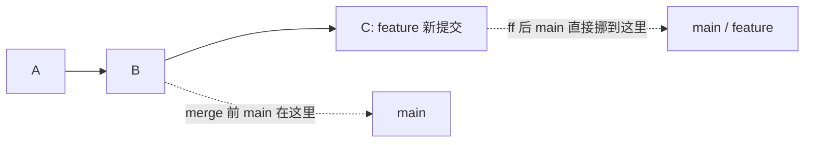
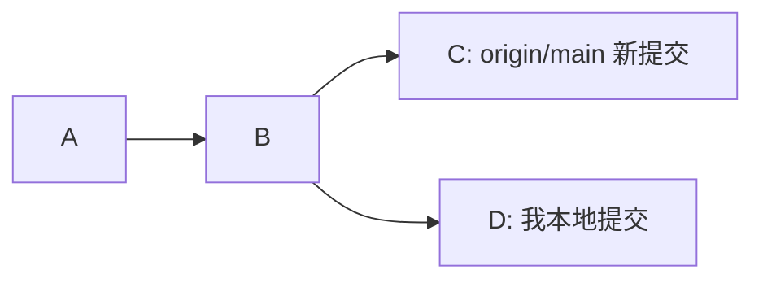

我本地刚提交了一点东西，还没 push，为了保持 git 链路干净，我执行 `git pull --rebase`，我对他的概念不够透彻，然后冲突了。

打开 VS Code 一看：

- `Current Change` 不是我刚写的
- `Incoming Change` 反而是我刚写的

第一反应是：这不对吧？？？

后来才发现，不是 VS Code 标错了，是我一直把 `Current` 和 `Incoming` 脑补成了“我的”和“别人的”。这两个词对我这个英语菜鸟而言真的很容易把人带歪。

其实 Git 不关心代码是谁写的。它只关心当前正在做什么动作：

- `Current`：当前工作树里已经放着的内容
- `Incoming`：这一步正在尝试应用进来的修改

在普通 `merge` 里，`Current` 往往是我的本地分支；到了 `rebase`，Git 会先站到新基线上，再重新应用我的 commit，于是 `Current` 和 `Incoming` 看起来就“反了”。

我干脆用两个临时 clone 真跑了一遍，也顺手把 Fast-forward、Merge commit、Squash 和 Rebase 这几种常见合并方式整理清楚。

## 先说结论：Git 合并策略怎么选

我现在的选法很朴素：

没有分叉时用 Fast-forward；只想保留 PR 最终结果时用 Squash；需要保留分支合并上下文时用 Merge commit；想保持线性历史，而且这些 commit 还没有被别人依赖时，再考虑 Rebase。

| 场景 | 更适合的选择 | 原因 |
|---|---|---|
| 本地和远程没有分叉，只想安全更新 | `git pull --ff-only` | 只移动分支指针，不额外制造提交 |
| 自己的 feature 分支要同步最新 `main`，commit 还没被别人依赖 | `git fetch origin` + `git rebase origin/main` | 主线保持线性，冲突也在本地解决 |
| PR 里有很多 `wip`、`fix typo` | `Squash and merge` | 主线只保留一条完整结果 |
| 一个 PR 本身是一段需要保留的协作上下文 | `Create a merge commit` | 能看出分支何时、以什么整体合入 |
| 团队明确要求线性历史，又想保留 PR 内每个 commit 的颗粒度 | `Rebase and merge` | 不生成 merge commit，但会重写 commit hash |

我的底线就两条：**公共分支别随便 rebase；push 被拒时先看分叉，别上来就 `--force`。**

至于 VS Code 冲突界面，也不要把 `Current` 当成“我的”、`Incoming` 当成“别人的”。先看你正在 `merge` 还是 `rebase`。

## Git merge、squash、rebase 到底有什么区别

严格来说，这里比较的是日常协作中的“历史整合方式”。Git 文档里的 merge strategy 特指 `ort`、`octopus`、`ours` 等内部合并算法。平时大家说“Git 合并策略怎么选”，讨论的通常还是前者。

| 方式 | 整合后的历史 | 原提交 hash | 是否保留这次分叉拓扑 |
|---|---|---|---|
| Fast-forward | 只把分支指针向前移动 | 不变 | 原本就没有分叉 |
| Merge commit | 新增一个 merge commit | 不变 | 保留 |
| Squash | 新增一个代表最终结果的普通 commit | 原 commit 不进入目标分支历史 | 不保留 |
| Rebase | 把当前分支的 commit 重新放到新基线上 | 被 replay 的 commit 会改变 | 通常不保留这次分叉拓扑 |

### Fast-forward：没有分叉时只移动指针

Fast-forward 是最简单的情况：当前分支正好是待合入分支的祖先，Git 只需要把当前分支指针往前移动。



> Fast-forward 就是“这条路没分叉，牌子往前挪一下就行”。

整个过程不会产生新的 merge commit。`git merge --ff-only <branch>` 和 `git pull --ff-only` 还可以把它当成一道保险：能快进就继续，发现历史已经分叉就停下来，让我自己决定该 merge 还是 rebase。

### Merge commit：保留分支合并上下文

如果两个分支都从共同祖先继续产生了提交，普通 `git merge` 会把两条历史汇合起来，并生成一个有多个 parent 的 merge commit。

优点：

- 保留真实的分支拓扑
- 能看出这个 PR 是什么时候整体合进来的
- 一个 PR 本身就是完整事件时，上下文不会被压平

缺点：

- 历史会长得比较乱
- 小改动也留一个 merge commit，有时候看着烦

较新的 Git 在合并两个分支时默认使用 `ort` 策略。平时不用专门操作它，但命令输出里经常会看到：

```text
Merge made by the 'ort' strategy.
```

### Squash merge：只把最终结果放进主线

Squash merge 只把分支的最终改动合成一个新 commit 放到目标分支，不保留原分支每个 commit 的颗粒度，也不会像普通 merge 那样记录双方的合并关系。

适合那种：

- PR 里有很多 `fix typo`
- `wip`
- `再修一次`
- `真的最后一次`

这种过程型 commit 如果全进主线，未来看历史会很痛苦。代价也很明确：原来的 commit 颗粒度没了。

所以它适合“过程不重要，最终结果重要”的 PR。

本地 `git merge --squash` 只会更新工作树和暂存区，还需要手动 commit；GitHub 的 `Squash and merge` 则会直接创建那条合并后的 commit。

### Rebase：把提交重新应用到新基线

`rebase` 也能整合两条历史，但动作和 `merge` 不一样。可以先把它理解成：

1. 先把我自己的 commit 暂时拿下来
2. 把当前分支移动到新的基线
3. 再把我的 commit 一个一个重新播放上去

rebase 前：



rebase 后：


优点：

- 历史很直
- 小分支同步 `main` 时很舒服
- PR 合进去之后主线比较干净

缺点：

- 被重新播放的 commit 会获得新的 commit hash
- 如果你 rebase 了已经被别人基于开发的公共分支，会让别人很难受
- 冲突时 `Current` / `Incoming` 很容易把人绕晕

也正因为 Git 是把 commit 一个个重新播放，冲突可能不只解决一次。一个 commit 处理完后执行 `git rebase --continue`，后面的 commit 如果又撞到同一片代码，还可能继续冲突。

## merge 与 rebase 冲突中 Current / Incoming 为什么会反转

我用两个临时 clone 模拟了一次协作：

- `alice`：我本地
- `bob`：另一个人
- `origin.git`：远程仓库

共同起点是：

```text
title: hello
owner: base
```

然后：

- Bob 把 `owner` 改成 `bob`，并且推到了远程
- Alice 在没同步的情况下，把 `owner` 改成 `alice`

这时历史是分叉的。

### merge 冲突：Current 是当前分支

Alice 执行：

```bash
git pull --no-rebase origin main
```

真实输出摘一段：

```text
$ git pull --no-rebase origin main
From /tmp/git-collab-demo.dg8XHP/origin
 * branch            main       -> FETCH_HEAD
   120e92f..a1b7aa2  main       -> origin/main
Auto-merging app.txt
CONFLICT (content): Merge conflict in app.txt
Automatic merge failed; fix conflicts and then commit the result.
```

冲突文件里是：

```text
title: hello
<<<<<<< HEAD
owner: alice
=======
owner: bob
>>>>>>> a1b7aa2f270ffdaa7b449578a038d9d2d5316eb6
```

这里 `HEAD` 是 Alice 当前分支。

所以在 VS Code 里大概就是：

| VS Code | 这次 merge 里是谁 |
|---|---|
| Current Change | Alice 本地内容 |
| Incoming Change | Bob 远程内容 |

这看起来很符合直觉，真正把我绕进去的是下面的 rebase。

### rebase 冲突：Current 是新基线

然后我 abort 掉 merge，再来一次：

```bash
git merge --abort
git pull --rebase origin main
```

真实输出：

```text
$ git pull --rebase origin main
From /tmp/git-collab-demo.dg8XHP/origin
 * branch            main       -> FETCH_HEAD
Rebasing (1/1)
Auto-merging app.txt
CONFLICT (content): Merge conflict in app.txt
error: could not apply 1308a1b... alice edits owner
hint: Resolve all conflicts manually, mark them as resolved with
hint: "git add/rm <conflicted_files>", then run "git rebase --continue".
hint: You can instead skip this commit: run "git rebase --skip".
hint: To abort and get back to the state before "git rebase", run "git rebase --abort".
hint: Disable this message with "git config set advice.mergeConflict false"
Could not apply 1308a1b... # alice edits owner
```

冲突文件变成了：

```text
title: hello
<<<<<<< HEAD
owner: bob
=======
owner: alice
>>>>>>> 1308a1b (alice edits owner)
```

注意这里，`HEAD` 现在是 Bob 的内容。因为 rebase 已经先以远程 `main` 作为新基线，然后才尝试重新播放 Alice 的 commit。

所以在 VS Code 里大概就是：

| VS Code | 这次 rebase 里是谁 |
|---|---|
| Current Change | Bob / 当前已经构造好的新历史 |
| Incoming Change | Alice / 正在 replay 的 commit |

这就是最容易懵的地方：`Incoming` 居然是我刚写的代码。

完全正常。不是 VS Code 坏了，是 rebase 的动作决定了它会这样显示。

这个实验只有一个本地 commit。如果有多个 commit，Git 会按顺序 replay。此时 `Current` 不只包含最初的新基线，还包含前面已经成功 replay 的结果；`Incoming` 则是当前正在应用的那一个 commit。

[Git 的 rebase 文档](https://git-scm.com/docs/git-rebase#Documentation/git-rebase.txt---merge)也专门说明了这一点：发生冲突时，`ours` 是已经构造到当前进度的新历史，`theirs` 是正在被 rebase 的工作分支。原文最后一句很直接：`the sides are swapped`。

## 一张表记住 Current 与 Incoming

不要把这两个词翻译成“我的”和“别人的”。

更准确的记法：

| 操作 | Current | Incoming |
|---|---|---|
| `git merge other` | 当前 checkout 的分支 | 被 merge 进来的分支 |
| `git pull --no-rebase origin main` | 本地当前分支 | 本次拉取的远程分支 |
| `git rebase origin/main` | 新基线 + 前面已 replay 的结果 | 当前正在 replay 的 commit |
| `git pull --rebase origin main` | 本次拉取的分支 + 前面已 replay 的结果 | 当前正在 replay 的 commit |

不带参数的 `git pull --rebase` 会使用当前分支配置的 upstream，它不一定是 `origin/main`。feature 分支如果跟踪的是 `origin/feature`，那它拉取并 rebase 的也是 `origin/feature`。

所以 VS Code 那两个按钮只能这样理解：

- `Accept Current Change`：这个冲突块保留 Current 一侧
- `Accept Incoming Change`：这个冲突块保留 Incoming 一侧

但这不等于 rebase 时应该无脑点 `Incoming`。真实冲突经常需要把两边内容手工组合起来，直接选一边可能会丢掉另一边的有效修改。

处理完后再继续：

```bash
git status
# 手工检查并修改冲突文件
git add app.txt
git rebase --continue
```

如果发现方向不对，可以用 `git rebase --abort` 回到 rebase 之前。`git rebase --skip` 会跳过当前整个 commit，可能直接丢掉这一条提交的改动，没看清楚之前不要乱按。

## Fast-forward、Merge commit 和 Squash 的真实输出

### Fast-forward 输出

```text
$ git merge --ff-only ff-topic
Updating 6a77bd7..b56f82d
Fast-forward
 story.txt | 1 +
 1 file changed, 1 insertion(+)

$ git log --oneline --graph --decorate --all --max-count=6
* b56f82d (HEAD -> main, ff-topic) add ff line
* 6a77bd7 base commit
```

可以看到，没有多一个合并节点。

### Merge commit 输出

```text
$ git merge --no-ff noff-topic -m "merge noff topic"
Merge made by the 'ort' strategy.
 noff.txt | 1 +
 1 file changed, 1 insertion(+)
 create mode 100644 noff.txt

$ git log --oneline --graph --decorate --all --max-count=10
*   3f79fbb (HEAD -> main) merge noff topic
|\
| * 2c1c14d (noff-topic) add noff branch file
* | cb8421c main moves too
|/
* b56f82d (ff-topic) add ff line
* 6a77bd7 base commit
```

这里多出来的 `3f79fbb` 就是 merge commit。

### Squash merge 输出

```text
$ git merge --squash squash-topic
Updating 3f79fbb..9dadb10
Fast-forward
Squash commit -- not updating HEAD
 squash-one.txt | 1 +
 squash-two.txt | 1 +
 2 files changed, 2 insertions(+)
 create mode 100644 squash-one.txt
 create mode 100644 squash-two.txt

$ git status --short
A  squash-one.txt
A  squash-two.txt

$ git commit -m "squash topic into one commit"
[main 0db1460] squash topic into one commit
 2 files changed, 2 insertions(+)
 create mode 100644 squash-one.txt
 create mode 100644 squash-two.txt
```

注意这个输出：

```text
Squash commit -- not updating HEAD
```

Squash 只是把改动放进暂存区，最后还要自己 commit 一下。

### `--ff`、`--no-ff` 和 `--ff-only` 别混在一起

上面的 merge 示例里，两条历史本来就已经分叉，即使不写 `--no-ff` 也会生成 merge commit。三个参数真正的区别是：

| 参数 | 行为 |
|---|---|
| `--ff` | 能 Fast-forward 就直接快进，不能快进时生成 merge commit；这是普通 merge 的常见默认行为 |
| `--no-ff` | 即使能够 Fast-forward，也强制生成 merge commit |
| `--ff-only` | 只允许 Fast-forward；只要历史分叉就直接失败，不替我做决定 |

## GitHub PR 的三种合并按钮怎么选

GitHub PR 常见的三个按钮，对应的是三种不同的主线历史：

| GitHub 按钮 | 合入后的结果 | 我会倾向的场景 |
|---|---|---|
| `Create a merge commit` | 保留分支原 commit，并额外生成 merge commit | 一个 PR 就是一段值得保留的完整上下文 |
| `Squash and merge` | 把 PR 的最终改动作为一个新 commit 放进目标分支 | 小修小补，过程 commit 很碎 |
| `Rebase and merge` | 把 PR 中的 commit 逐个放到目标分支顶端，不生成 merge commit | 团队要求线性历史，又想保留 PR 内每个 commit 的颗粒度 |

GitHub 的 `Rebase and merge` 会为这些提交生成新的 commit hash。`Squash and merge` 则只让压缩后的新 commit 进入目标分支历史，原来的那些 commit 不会作为独立提交出现在目标分支上。

> PR 按钮不是信仰问题。主要看这个 repo 是更想保留“协作过程”，还是更想保留“干净结果”。仓库已经有约定时，跟约定走最省事。

## Git 协作里最容易踩的几个坑

### push 被拒时先看分叉，不要直接 force

别人已经推了新的 `main`，我本地还不知道，这时直接 push 会看到类似报错：

```text
$ git push origin main
To /tmp/git-common-problems/origin.git
 ! [rejected]        main -> main (fetch first)
error: failed to push some refs to '/tmp/git-common-problems/origin.git'
hint: Updates were rejected because the remote contains work that you do not
hint: have locally. This is usually caused by another repository pushing to
hint: the same ref.
```

这时候不要一怒之下 `--force`。先 fetch，再看一眼提交图：

```bash
git fetch origin
git log --oneline --graph --decorate --all --max-count=20
```

确认只是远程向前走了，还是两边真的已经分叉，再决定 merge 还是 rebase。

### `--ff-only` 失败不是坏事

我比较喜欢用：

```bash
git pull --ff-only origin main
```

只要本地和远程各自都有新提交，它就会停下来：

```text
fatal: Not possible to fast-forward, aborting.
```

这个报错不是坏事。它是在提醒我：现在已经不是“把指针往前挪一下”能解决的状态了，必须自己选择保留分叉的 merge，或者改写本地提交的 rebase。

### rebase 已推送的 feature 分支要谨慎覆盖

rebase 会改变被 replay commit 的 hash。如果这个 feature 分支以前已经推送过，普通 push 往往会因为不是 Fast-forward 而被拒绝。

确认这个分支只有自己使用，并且确实需要更新远程历史时，可以明确写出目标分支：

```bash
git push --force-with-lease origin my-feature
```

`--force-with-lease` 只会在远程分支仍处于本地预期位置时允许覆盖；如果远程 ref 已经变化，它会拒绝推送。它比 `--force` 安全，但不等于绝对保险，更不该拿来随便改写公共分支，尤其是 `main`。

### `git pull --rebase` 不会自动帮 feature 同步 main

不带参数的 `git pull --rebase` 会先 fetch，再把当前分支 rebase 到它配置的 upstream 上。

如果 `my-feature` 跟踪的是 `origin/my-feature`，那它同步的是远程 feature，不是 `origin/main`。我想明确把 feature 放到最新主线后面时，更愿意把动作拆开写：

```bash
git fetch origin
git rebase origin/main
```

这样一眼就知道新基线是谁，也不容易把“拉远程 feature”和“同步主线”混成一件事。

## 我现在的默认用法

没有仓库特殊约定时，我目前大概会这样处理：

更新本地 `main`：

```bash
git switch main
git pull --ff-only origin main
```

自己的 feature 分支在合 PR 前同步主线：

```bash
git switch my-feature
git fetch origin
git rebase origin/main
```

PR 很小、commit 很碎就 Squash；PR 本身是一段完整上下文就保留 merge commit；团队要求线性历史，又想保留 PR 内每个 commit 的颗粒度时，再用 Rebase and merge。

至于冲突，先看动作，再看内容，不按“我的”和“别人的”猜按钮。

这个关系想通之后，VS Code 的冲突界面确实少了很多玄学。至少下次看到 `Incoming` 是自己刚写的代码时，不会第一时间怀疑人生。

## 参考资料

- [Git 官方文档：git merge](https://git-scm.com/docs/git-merge)
- [Git 官方文档：git rebase](https://git-scm.com/docs/git-rebase)
- [Git 官方文档：git pull](https://git-scm.com/docs/git-pull)
- [GitHub Docs：About merge methods on GitHub](https://docs.github.com/en/repositories/configuring-branches-and-merges-in-your-repository/configuring-pull-request-merges/about-merge-methods-on-github)

收工。
