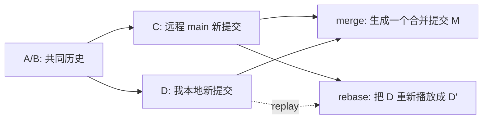
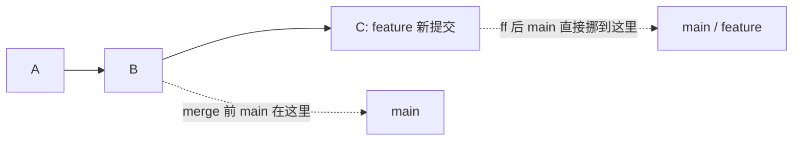
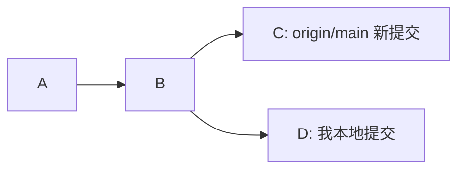
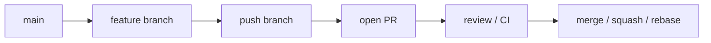

> 这篇先写成大纲。
>
> 我最近主要是想把 `git merge`、`git rebase`、`git pull --rebase` 这几件事情理一下，尤其是 VS Code 冲突界面里的 `Current Change` 和 `Incoming Change`。
>
> Damn，这两个词真的很容易让人误会成“我的”和“别人的”。

## 开头想怎么写

起因可以从一个很常见的场景开始：

我本地刚写了一点东西，然后 `git pull --rebase`，结果冲突了。

打开 VS Code 一看：

- `Current Change` 不是我刚写的
- `Incoming Change` 反而是我刚写的

第一反应大概是：

这不对吧？？？

后来才发现，这不是 VS Code 标错了，是我把 `Current` 和 `Incoming` 脑补成了“我的”和“别人的”。

其实 Git 根本不关心谁写的。

它只关心：

- `Current`：当前工作树里已经放着的内容
- `Incoming`：现在正准备应用进来的那份修改

这俩在 `merge` 和 `rebase` 里，来源刚好不一样。

## 先放一张总图

这里适合放一张轻量图，不需要太复杂。



配图想法：

- 可以画成三条岔路：`merge commit`、`squash merge`、`rebase`
- `rebase` 那条路可以画成“把自己的箱子搬到别人新修好的路后面”
- 后面如果要上图床，可以换成 `TODO_UPLOAD_IMAGE_01`

## 要讲的几个主要策略

这里先不写成很密的教程，只讲日常协作里最常遇到的几种。

### 1. Fast-forward

最简单。

如果 `main` 没有新提交，而你的分支只是在 `main` 后面往前走了一段，Git 可以直接把 `main` 指针往前挪。

没有 merge commit。

像这样：



可以补一句我的记法：

> Fast-forward 就是“这条路没分叉，牌子往前挪一下就行”。

### 2. Merge commit

如果两边都往前走了，Git 就要把两条线合到一起。

这时通常会产生一个 merge commit。

优点：

- 历史很真实
- 能看出这个 PR 是什么时候整体合进来的
- 大 feature 或多人协作时比较稳

缺点：

- 历史会长得比较乱
- 小改动也留一个 merge commit，有时候看着烦

Git 现在默认用的内部合并算法一般是 `ort`。这个平时不用太管，但冲突输出里可能会看到：

```text
Merge made by the 'ort' strategy.
```

### 3. Squash merge

把一个分支上的多个 commit 压成一个 commit，再放到 `main` 上。

适合那种：

- PR 里有很多 `fix typo`
- `wip`
- `再修一次`
- `真的最后一次`

这种 commit 如果都进主线，未来看历史会很痛苦。

Squash 的问题是：原来的 commit 颗粒度没了。

所以它适合“过程不重要，结果重要”的 PR。

### 4. Rebase

`rebase` 不是“合并远程到我这里”。

它更像是：

1. 先把我自己的 commit 暂时拿下来
2. 把当前分支移动到新的基线
3. 再把我的 commit 一个一个重新播放上去

图大概这样：



rebase 之后，视觉上更像：


优点：

- 历史很直
- 小分支同步 `main` 时很舒服
- PR 合进去之后主线比较干净

缺点：

- 会改 commit hash
- 如果你 rebase 了已经被别人基于开发的公共分支，会让别人很难受
- 冲突时 `Current` / `Incoming` 很容易把人绕晕

## 实操 1：merge 和 rebase 冲突里 Current / Incoming 的反转

我本地真跑了一次。

用两个 clone 模拟协作：

- `alice`：我本地
- `bob`：另一个人
- `origin.git`：远程仓库

共同起点是：

```text
title: hello
owner: base
```

然后：

- Bob 把 `owner` 改成 `bob`，并且推到了远程
- Alice 在没同步的情况下，把 `owner` 改成 `alice`

这时历史是分叉的。

### merge 冲突

Alice 执行：

```bash
git pull --no-rebase origin main
```

真实输出摘一段：

<details>
<summary>展开 merge 冲突输出</summary>

```text
$ git pull --no-rebase origin main
From /tmp/git-collab-demo.dg8XHP/origin
 * branch            main       -> FETCH_HEAD
   120e92f..a1b7aa2  main       -> origin/main
Auto-merging app.txt
CONFLICT (content): Merge conflict in app.txt
Automatic merge failed; fix conflicts and then commit the result.
```

</details>

冲突文件里是：

```text
title: hello
<<<<<<< HEAD
owner: alice
=======
owner: bob
>>>>>>> a1b7aa2f270ffdaa7b449578a038d9d2d5316eb6
```

这里 `HEAD` 是 Alice 当前分支。

所以在 VS Code 里大概就是：

| VS Code | 这次 merge 里是谁 |
|---|---|
| Current Change | Alice 本地内容 |
| Incoming Change | Bob 远程内容 |

这个很符合直觉，所以大家第一次一般不会在这里困惑。

### rebase 冲突

然后我 abort 掉 merge，再来一次：

```bash
git merge --abort
git pull --rebase origin main
```

真实输出：

<details>
<summary>展开 rebase 冲突输出</summary>

```text
$ git pull --rebase origin main
From /tmp/git-collab-demo.dg8XHP/origin
 * branch            main       -> FETCH_HEAD
Rebasing (1/1)
Auto-merging app.txt
CONFLICT (content): Merge conflict in app.txt
error: could not apply 1308a1b... alice edits owner
hint: Resolve all conflicts manually, mark them as resolved with
hint: "git add/rm <conflicted_files>", then run "git rebase --continue".
hint: You can instead skip this commit: run "git rebase --skip".
hint: To abort and get back to the state before "git rebase", run "git rebase --abort".
hint: Disable this message with "git config set advice.mergeConflict false"
Could not apply 1308a1b... # alice edits owner
```

</details>

冲突文件变成了：

```text
title: hello
<<<<<<< HEAD
owner: bob
=======
owner: alice
>>>>>>> 1308a1b (alice edits owner)
```

注意这里。

`HEAD` 现在是 Bob 的内容。

因为 rebase 已经先把当前分支移动到了远程 `main` 上。

然后 Git 正在把 Alice 的 commit 重新播放进来。

所以在 VS Code 里大概就是：

| VS Code | 这次 rebase 里是谁 |
|---|---|
| Current Change | Bob / 新基线 / `origin/main` |
| Incoming Change | Alice / 正在 replay 的 commit |

这就是最容易懵的地方。

`Incoming` 是我刚刚写的代码。

完全正常。

不是 VS Code 坏了。

是 rebase 的动作决定了它会这样显示。

## 我自己的记法

不要把这两个词翻译成“我的”和“别人的”。

更准确的记法：

| 操作 | Current | Incoming |
|---|---|---|
| `git merge other` | 当前 checkout 的分支 | 被 merge 进来的分支 |
| `git pull --no-rebase` | 本地当前分支 | 远程拉下来的内容 |
| `git rebase main` | 新基线，也就是 rebase onto 的地方 | 正在 replay 的 commit |
| `git pull --rebase` | 通常是 `origin/main` | 通常是我本地还没推的 commit |

所以 VS Code 那两个按钮可以这样理解：

- `Accept Current Change`：保留当前工作树这边
- `Accept Incoming Change`：保留正在应用进来的 patch

在 rebase 里，如果我想保留自己那个 commit 的改法，很多时候反而要点 `Incoming`。

这句话值得加粗。

但先不加了，省得我自己以后看到又觉得像公众号[Doge]

## 实操 2：几种策略跑出来长什么样

这组主要是给文章后面扩写用的素材。

### Fast-forward 输出

<details>
<summary>展开 fast-forward 输出</summary>

```text
$ git merge --ff-only ff-topic
Updating 6a77bd7..b56f82d
Fast-forward
 story.txt | 1 +
 1 file changed, 1 insertion(+)

$ git log --oneline --graph --decorate --all --max-count=6
* b56f82d (HEAD -> main, ff-topic) add ff line
* 6a77bd7 base commit
```

</details>

可以看到，没有多一个合并节点。

### Merge commit 输出

<details>
<summary>展开 merge commit 输出</summary>

```text
$ git merge --no-ff noff-topic -m "merge noff topic"
Merge made by the 'ort' strategy.
 noff.txt | 1 +
 1 file changed, 1 insertion(+)
 create mode 100644 noff.txt

$ git log --oneline --graph --decorate --all --max-count=10
*   3f79fbb (HEAD -> main) merge noff topic
|\
| * 2c1c14d (noff-topic) add noff branch file
* | cb8421c main moves too
|/
* b56f82d (ff-topic) add ff line
* 6a77bd7 base commit
```

</details>

这里多出来的 `3f79fbb` 就是 merge commit。

### Squash merge 输出

<details>
<summary>展开 squash merge 输出</summary>

```text
$ git merge --squash squash-topic
Updating 3f79fbb..9dadb10
Fast-forward
Squash commit -- not updating HEAD
 squash-one.txt | 1 +
 squash-two.txt | 1 +
 2 files changed, 2 insertions(+)
 create mode 100644 squash-one.txt
 create mode 100644 squash-two.txt

$ git status --short
A  squash-one.txt
A  squash-two.txt

$ git commit -m squash topic into one commit
[main 0db1460] squash topic into one commit
 2 files changed, 2 insertions(+)
 create mode 100644 squash-one.txt
 create mode 100644 squash-two.txt
```

</details>

注意这个输出：

```text
Squash commit -- not updating HEAD
```

Squash 只是把改动放进暂存区，最后还要自己 commit 一下。

## PR 里的三种按钮

GitHub PR 里常见就是这三个：

- `Create a merge commit`
- `Squash and merge`
- `Rebase and merge`

这一段可以不用展开太多，直接写我自己的选择：

| 场景 | 我会倾向 |
|---|---|
| 小修小补，commit 很碎 | `Squash and merge` |
| 一个 PR 就是一段完整上下文 | `Create a merge commit` |
| 团队强制线性历史 | `Rebase and merge` |
| 本地同步主线 | `git pull --rebase` 或 `git fetch` + `git rebase origin/main` |

补一句：

> PR 按钮不是信仰问题。主要看这个 repo 是更想保留“协作过程”，还是更想保留“干净结果”。

## 协作里容易遇到的问题

### 1. push 被拒

这个很常见。

别人已经推了新的 main，你本地还不知道，然后你直接 push。

真实输出：

<details>
<summary>展开 push rejected 输出</summary>

```text
$ git push origin main
To /tmp/git-common-problems.znKUhT/origin.git
 ! [rejected]        main -> main (fetch first)
error: failed to push some refs to '/tmp/git-common-problems.znKUhT/origin.git'
hint: Updates were rejected because the remote contains work that you do not
hint: have locally. This is usually caused by another repository pushing to
hint: the same ref. If you want to integrate the remote changes, use
hint: 'git pull' before pushing again.
hint: See the 'Note about fast-forwards' in 'git push --help' for details.
```

</details>

这时候不要一怒之下 `--force`。

先 `git fetch`，看一眼图：

```bash
git fetch origin
git log --oneline --graph --decorate --all --max-count=20
```

再决定 merge 还是 rebase。

### 2. `--ff-only` 失败

如果仓库要求线性历史，或者你自己习惯保守一点，可能会用：

```bash
git pull --ff-only origin main
```

但只要两边都各自有提交，它就会失败。

真实输出：

<details>
<summary>展开 ff-only 失败输出</summary>

```text
$ git pull --ff-only origin main
From /tmp/git-ffonly-problem.4WRkiI/origin
 * branch            main       -> FETCH_HEAD
   c159392..ad75f2a  main       -> origin/main
hint: Diverging branches can't be fast-forwarded, you need to either:
hint:
hint: 	git merge --no-ff
hint:
hint: or:
hint:
hint: 	git rebase
hint:
hint: Disable this message with "git config set advice.diverging false"
fatal: Not possible to fast-forward, aborting.
```

</details>

这个报错不是坏事。

它是在提醒我：现在已经不是“指针往前挪一下”能解决的状态了。

### 3. rebase 后 push 被拒

这个大纲里可以补一段，但不需要现场展开太多。

核心是：

- rebase 会改 commit hash
- 如果这个分支之前已经 push 过，远程看到的是“你不是接在我后面”
- 所以普通 push 可能被拒

自己的 feature 分支可以考虑：

```bash
git push --force-with-lease
```

但公共分支，尤其是 `main`，别乱来。

`--force-with-lease` 至少比 `--force` 客气一点。

它会先确认远程没有别人新推的东西。

### 4. 解决冲突时选错按钮

这就是本文核心。

尤其是 `git pull --rebase`：

- 看到 `Current`，不要条件反射以为是“我的”
- 看到 `Incoming`，也不要条件反射以为是“别人的”

先看现在正在做什么操作。

如果是 rebase，大概率：

- `Current` 是远程新基线
- `Incoming` 是我自己的 commit

## 常见协作模式

### 模式 1：feature branch + PR

最常见。



适合：

- 多人协作
- 有 code review
- 有 CI
- 不想让 main 天天直接冒烟

### 模式 2：小团队线性历史

习惯是：

```bash
git fetch origin
git rebase origin/main
git push
```

或者：

```bash
git pull --rebase
git push
```

优点是历史干净。

缺点是新人第一次遇到冲突时会比较懵。

我觉得这篇文章主要就是给这个场景写的。

### 模式 3：保留合并上下文

大 feature、多人一起做的分支，直接 merge commit 有时候更自然。

因为一个 PR 本身就是一个事件。

保留它不丢人。

## 最后可以怎么收

大概就收在这个判断上：

Git 里很多词不要按“人”去理解，要按“动作”理解。

`Current` 和 `Incoming` 尤其是这样。

merge 的动作是“把别人合进我当前这里”。

所以：

- Current 像是我
- Incoming 像是别人

rebase 的动作是“我先站到新基线上，再把自己的 commit 重新播放进去”。

所以：

- Current 变成新基线
- Incoming 反而变成我自己的 commit

这个理解通了之后，冲突界面会少很多玄学。

至少下次看到 `Incoming` 是自己刚写的代码时，不会第一时间怀疑人生。

收工。
