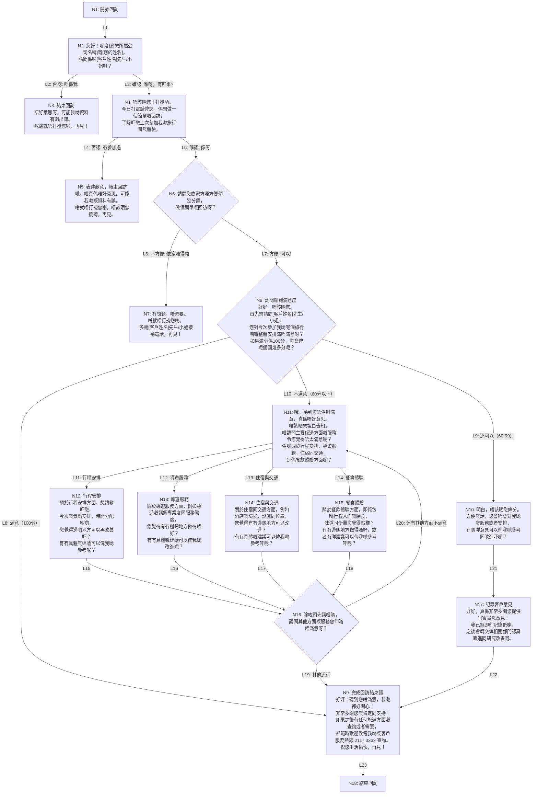

这个 logo 叫 gpt 给我画的，元素就是姓名首字母啦，还是蛮喜欢的

本次博客换了个主题和评论系统，参考文章放在末尾了

```mermaid
flowchart TD
    A[N1: 開始回訪] --> |L1| B["N2: 您好！呢度係[您所屬公司名稱]嘅[您的姓名]。<br/>請問係咪[客戶姓名]先生/小姐呀？"]
    B -->|L2: 否認: 唔係我| D["N3: 結束回訪<br/>唔好意思呀，可能我哋資料有啲出錯。<br/>呢邊就唔打攪您啦，再見！"]
    B -->|L3: 確認: 喺呀，有咩事?| E["N4: 唔該晒您！打攪晒。<br/>今日打電話俾您，係想做一個簡單嘅回訪，<br/>了解吓您上次參加我哋旅行團嘅體驗。"]
    E -->|L4: 否認: 冇參加過| G["N5: 表達歉意，結束回訪<br/>哦，咁真係唔好意思。可能我哋嘅資料有誤。<br/>咁就唔打攪您喇，唔該晒您接聽，再見。"]
    E -->|L5: 確認: 係呀| H{N6: 請問您依家方唔方便傾幾分鐘，<br/>做個簡單嘅回訪呀？}
    H -->|L6: 不方便: 依家唔得閒| J["N7: 冇問題，唔緊要。<br/>咁就唔打攪您喇。<br/>多謝[客戶姓名]先生/小姐接聽電話，再見！"]
    H -->|L7: 方便: 可以!| L{"N8: 詢問總體滿意度<br/>好好，唔該晒您。<br/>首先想請問[客戶姓名]先生/小姐，<br/>您對今次參加我哋呢個旅行團嘅整體安排滿唔滿意呀？<br/>如果滿分係100分，您會俾呢個團幾多分呢？"}
    L -->|L8: 满意（100分）| R["N9: 完成回訪結束語<br/>好好！聽到您咁滿意，我哋都好開心！<br/>非常多謝您嘅肯定同支持！<br/>如果之後有任何旅遊方面嘅查詢或者需要，<br/>都隨時歡迎致電我哋嘅客戶服務熱線 2117 3333 查詢。<br/>祝您生活愉快，再見！"]
    L -->|L9: 还可以（60-99）| T["N10: 明白，唔該晒您俾分。<br/>方便嘅話，您會唔會對我哋嘅服務或者安排，<br/>有啲咩意見可以俾我哋參考同改進吓呢？"]
    L -->|L10: 不满意（60分以下）| LS_Category["N11: 哦，聽到您唔係咁滿意，真係唔好意思。<br/>唔該晒您坦白告知。<br/>咁請問主要係邊方面嘅服務令您覺得唔太滿意呢？<br/>係咪關於行程安排，導遊服務，住宿同交通，<br/>定係餐飲體驗方面呢？"]
    LS_Category -->|L11: 行程安排| LS1["N12: 行程安排<br/>關於行程安排方面，想請教吓您，<br/>今次嘅景點安排、時間分配嗰啲，<br/>您覺得邊啲地方可以再改善吓？<br/>有冇具體嘅建議可以俾我哋參考呢？"]
    LS_Category -->|L12: 導遊服務| LS2["N13: 導遊服務<br/>關於導遊服務方面，例如導遊嘅講解專業度同服務態度，<br/>您覺得有冇邊啲地方做得唔好？<br/>有冇具體嘅建議可以俾我哋改進呢？"]
    LS_Category -->|L13: 住宿與交通| LS3["N14: 住宿與交通<br/>關於住宿同交通方面，例如酒店嘅環境、設施同位置，<br/>您覺得有冇邊啲地方可以改進？<br/>有冇具體嘅建議可以俾我哋參考吓呢？"]
    LS_Category -->|L14: 餐食體驗| LS4["N15: 餐食體驗<br/>關於餐飲體驗方面，即係包喺行程入面嘅膳食，<br/>味道同份量您覺得點樣？<br/>有冇邊啲地方做得唔好，或者有咩建議可以俾我哋參考吓呢？"]
    LS1 -->|L15| M{N16: 除咗頭先講嗰啲，<br/>請問其他方面嘅服務您仲滿唔滿意呀？}
    LS2 -->|L16| M
    LS3 -->|L17| M
    LS4 -->|L18| M
    M -->|L19: 其他还行| R
    M -->|L20: 还有其他方面不满意| LS_Category
    T -->|L21| Q["N17: 記錄客戶意見<br/>好好，真係非常多謝您提供咁寶貴嘅意見！<br/>我已經即刻記錄低喇，<br/>之後會轉交俾相關部門認真跟進同研究改善嘅。"]
    Q -->|L22| R
    R -->|L23| Z[N18: 結束回訪]
```

> 这个不是很能看懂

台运鹏. (Dec. 17, 2024). 《Hugo PaperMod 主题精装修》[Blog post]. Retrieved from http://yunpengtai.top/posts/hugo-journey/

 你好 