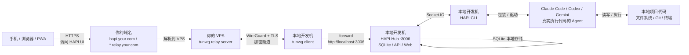

> 本文转载自 [Datawhale easy-vibe 教程](https://datawhalechina.github.io/easy-vibe/zh-cn/stage-3/core-skills/mobile-development/)，加了自己的理解和全链路自建的部分

## 手机上写代码？

地铁上突然想到一个 bug 怎么修，买一杯瑞排队的时候收到线上告警，躺床上不想起来但又想让 Claude 帮你跑个任务——这种场景太多了。传统 IDE 那套东西在手机上根本跑不动，虚拟键盘输入代码效率低得离谱，小屏幕连代码和终端都放不下。

但换个思路想，手机只需要当一个控制台就够了——输入指令、看结果、审批操作。真正干活的还是你家里/公司的开发机。

这就是"瘦客户端"的核心思想：手机只管发指令，活在别处干。

## 现有方案快速过一遍

社区里能用的方案其实不少了，快速过一下：

### iOS 官方 App

Anthropic 出的 Claude App 里直接有 Code 标签页。手机发指令，代码在 Anthropic 云端沙盒执行，结果通过 GitHub 同步。零配置，Pro 订阅就能用。但——中国大陆用不了，功能也受限，不能访问本地文件系统。pass。

### Happy Coder

开源的，跨平台（iOS/Android/Web），端到端加密。电脑上装个 `happy-coder`，手机扫码配对就能远程控制 Claude Code 和 Codex。配置简单，扫码即用，这个方案用的人很多。

但连接不太稳定，断线了上下文就丢了。而且依赖第三方中继服务器，代码安全心里没底。

### SSH + Tailscale + Tmux

最硬核的方案。Tailscale 做 VPN 打洞（打洞失败自动中继），手机用 SSH 客户端连上开发机，Tmux 保持会话不丢。功能最完整，桌面级体验。但配置复杂，电脑得一直开着，还得会 Tmux。适合老手。

### Termux

Android 用户可以在手机上直接跑 Claude Code CLI。装个 Termux（注意从 F-Droid 下，Google Play 版本过时了），装 Node.js，装 Claude Code，完事。手机性能有限，编译大型项目就算了，但写个 Python 脚本、跑个 Web 项目还是没问题的。仅限 Android。

### Claude Code UI

电脑上起个 Web 服务器，手机通过浏览器访问。支持局域网直接访问，外网需要内网穿透（ngrok 之类的）。图形界面，有文件浏览器和 Git 操作界面。体验还行，就是需要穿透。

## 重头戏：HAPI 全链路自建

前面那些方案要么依赖第三方服务器，要么配置复杂。HAPI 是 Happy Coder 的替代方案，设计上就是**本地优先**的。

### HAPI 和 Happy Coder 的区别

Happy Coder 是云端优先，你的流量过他们的中继服务器。HAPI 是本地优先，开箱就能自建中继。加密方式也不同——Happy Coder 用 WebSocket + E2E，HAPI 用 WireGuard + TLS。多模型支持方面 HAPI 也更强，除了 Claude Code 和 Codex 还支持 Gemini、OpenCode 这些。

| 特性 | Happy Coder | HAPI |
|------|-------------|------|
| 设计理念 | 云端优先 | 本地优先 |
| 加密方式 | WebSocket + E2E | WireGuard + TLS |
| 多模型 | Claude Code, Codex | Claude, Codex, Gemini, OpenCode |
| 访问方式 | iOS/Android/Web | PWA, Telegram, 更多 |
| 语音控制 | 没有 | 支持 |
| AFK 审批 | 没有 | 支持 |
| 自建中继 | 麻烦 | 开箱即用 |

### 全链路自建架构

这是我要重点讲的。按"全链路自建 + 本地开发机执行任务 + VPS 只做中继"的思路来画：



更直观点的简化版：

```text
手机
  |
  |  https://hapi.your.com
  v
你的 VPS
  |
  |  tunwg relay，只转发加密流量
  v
你的本地开发机
  |
  |  localhost:3006
  v
HAPI Hub
  |
  |  Socket.IO
  v
HAPI CLI -> Codex/Claude -> 本地代码仓库
```

### 核心原则

就三句话：

- **VPS**：只跑 tunwg relay，不存你的会话和代码
- **本地开发机**：跑 HAPI Hub + HAPI CLI + Agent + SQLite 数据库
- **手机**：只访问你自己的域名

VPS 就是个流量中转站，全程加密它啥也看不到。你的代码、会话、数据全在本地开发机上。

### 搞起来

#### 第一步：安装 HAPI

```bash
# 全局安装
npm install -g @twsxtd/hapi

# 或者临时用
npx @twsxtd/hapi
```

#### 第二步：自建 Relay

默认情况下 `hapi hub --relay` 会连接官方的 `relay.hapi.run`。你要自建的话，需要改环境变量：

```bash
# 设定你自己的 relay 域名和认证密钥
export HAPI_RELAY_API=relay.your.com
export HAPI_RELAY_AUTH=你的密钥
```

然后启动：

```bash
hapi hub --relay
```

这时候 HAPI Hub 会在本地起一个服务（默认 :3006），同时自动拉起 tunwg client 连接你的 relay 服务器。

#### 第三步：VPS 上跑 tunwg relay

VPS 上需要跑一个 tunwg relay server，负责转发加密流量。tunwg 基于 WireGuard + TLS，VPS 上只看到加密数据，解不开。

```bash
# VPS 上安装 tunwg
# 具体安装方式参考 tunwg 文档

# 启动 relay server，绑定你的域名
tunwg serve --domain relay.your.com
```

域名那边配好 DNS 解析，A 记录指向 VPS IP。如果要给 HAPI Web UI 单独一个子域名（比如 `hapi.your.com`），配一个通配符 `*.relay.your.com` 指过去就行。

#### 第四步：VPS 安全加固

既然 VPS 是面向公网的，基本安全得做好：

```bash
# 只开放必要端口
ufw default deny incoming
ufw default allow outgoing
ufw allow ssh
ufw allow 443/tcp    # HTTPS
ufw enable

# SSH 禁用密码登录
# /etc/ssh/sshd_config
# PasswordAuthentication no
# PermitRootLogin no
```

#### 第五步：手机端访问

浏览器打开 `https://hapi.your.com`，装个 PWA 就跟原生 App 一样。也支持 Telegram Mini App，在 Telegram 里直接用。

扫个码配对设备，完事。

### HAPI 的几个亮点

**无缝切换**：电脑前坐下了，按任意键就切回本地控制。手机端自动变成看客模式。再站起来，手机又接管了。

**AFK 审批**：离开电脑的时候 Claude 要执行一些需要审批的操作（比如写文件、跑命令），手机端会收到审批请求。不用再担心 Claude 在你不在的时候干了啥。

**多模型**：不只是 Claude Code，Codex、Gemini CLI、OpenCode 都能用。HAPI CLI 本质上是个包装器，底下跑哪个 Agent 你自己选。

**语音控制**：手机上对着说话就能发指令。地铁上打字不方便的时候这个真有用。

## 安全性

用第三方中继服务器（包括 Happy Coder 官方的），你的流量理论上都经过它们的服务器。如果 E2E 加密实现有问题，代码和 API Key 都可能泄露。

自建中继的好处就是这个中继是你自己的，VPS 上跑的 tunwg 只转发加密流量，它自己解不开。会话数据存在本地开发机的 SQLite 里，不过 VPS。

代码敏感度分级建议：

- 公开项目/学习代码 → 都行，第三方中继也无所谓
- 私人项目 → 自建中继或 SSH+Tailscale
- 商业代码 → 只用自建中继或 SSH+Tailscale，别碰第三方

## 方案对比

| 方案 | 难度 | 需要穿透 | 费用 | 适用场景 |
|------|------|---------|------|---------|
| iOS 官方 App | 简单 | 不需要 | $20/月 | 快速查看、简单任务（非中国大陆） |
| Happy Coder | 较简单 | 不需要 | 免费 | 日常使用，扫码即用 |
| **HAPI 自建** | **中等** | **不需要** | **免费** | **多模型、本地优先、数据安全** |
| SSH+Tailscale | 较复杂 | 不需要 | 免费 | 专业开发，功能最完整 |
| Termux | 中等 | 不需要 | 免费 | Android 本地开发 |
| Claude Code UI | 中等 | 需要 | 免费 | 需要 Web 界面 |
| 云端 DevBox | 简单 | 不需要 | 按量付费 | 没有常开电脑 |

## 怎么选

- 想要数据安全 + 多模型 → **HAPI 自建**
- 最省心 → Happy Coder，扫码就用
- 最硬核 → SSH + Tailscale
- 中国大陆 → Happy Coder（配国内 API 中转）
- 没有常开电脑 → 云端 DevBox

我个人推荐 HAPI 自建。VPS 成本不高（最低配就够），域名自己控制，数据全在本地，加密隧道自己看着。比把流量交给第三方服务器心里踏实多了。

> 原文内容很全面，七个方案都讲了，这里重点把 HAPI 自建的部分展开写了。想看完整的方案对比和更多细节的可以去 [原文](https://datawhalechina.github.io/easy-vibe/zh-cn/stage-3/core-skills/mobile-development/) 看看

HAPI 项目地址：[github.com/tiann/hapi](https://github.com/tiann/hapi)
